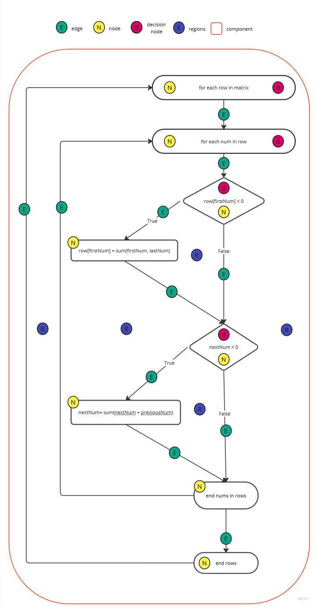
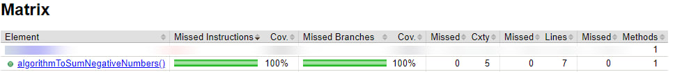

# Цикломатическая сложность кода

___
*В данной программе вычисляется цикломатическая сложность цикла в
функции `algorithmToSumNegativeNumbers()`*.

> Дано:
<br>Двумерный массив (матрица), который наполняется с помощью метода `fillRows()`

*В `algorithmToSumNegativeNumbers()` перебирается каждая строка матрицы, в каждой строке
перебираются значения и проверяются на отрицательные, начиная с индекса `1`. В каждой строке первое
значение строки под индексом `0` проверяется на отрицательное.*

> Условия для каждой строки в матрице:
<br>Если первое значение строки отрицательное, тогда первое значение строки суммируется с последним
> значением строки.
<br> Если значение строки отрицательное, тогда значение суммируется с предыдущим значением
> строки.

```java
public class Matrix {
  //...

  // метод у которого вычисляем цикломатическую сложность
  public void algorithmToSumNegativeNumbers() {
    for (int[] rowArray : matrix) {
      for (int index = 1; index < rowArray.length; index++) {
        if (isNegative(rowArray[0])) {
          rowArray[0] = sumCurrentNumWithPreviousNum(rowArray[0], rowArray[index - 1]);
        }
        if (isNegative(rowArray[index])) {
          rowArray[index] = sumCurrentNumWithPreviousNum(rowArray[index], rowArray[index - 1]);
        }
      }
    }
  }
}
```

---

### Блок-схема:



---

### 1. Цикломатическая сложность, основанная на ребрах и узлах

> M = E − N + 2 * P

где:

- M - цикломатическая сложность,
- E - количество рёбер в схеме,
- N - количество узлов в схеме,
- P - количество компонент связности.

Таким образом:
<br> e = 11
<br> n = 8
<br> P = 1

> M = 11 - 8 + 2 * 1
___

### 2. Цикломатическая сложность, основанная на узлах принятия решений

> M = d + P

где:

- M - цикломатическая сложность,
- d - количество узлов принятия решений,
- P - количество компонент связности.

Таким образом:
<br> d = 4
<br> P = 1

> M = 4 + 1
___

### 2. Цикломатическая сложность, основанная на регионах

> M = sum(R)

где:

- M - обозначает количество регионов.

Таким образом:
> M = 5

---

# Jacoco Reports

 
---

Чтобы посмотреть отчет Jacoco:

1. Открыть консоль в корне проекта
2. Ввести в консоль команду `.\gradlew test`
3. Сгенерируется папка build
4. В этой папке найти файл **index.html** (путь до файла "/build/reports/jacoco/test/html/")
5. Открыть его в браузере.

Отобразится отчет Jacoco:


***В случае, если какая-то часть кода не будет покрыта тестами, то напротив метода в
колонке `Missed` будет
отображено количество пропущенных тестовых сценариев.***

Jacoco рассчитывает цикломатическую сложность метода (количество линейно независимых маршрутов через
программный код) на основе количества ветвей B и количества точек принятия решения D с помощью
следующего уравнения:

v(G) = B - D + 1

На основе статуса покрытия каждой ветви Jacoco также рассчитывает покрываемую и пропущенную
сложность для каждого метода. А пропущенная сложность является показателем количества тестов,
недостающих для полного покрытия модуля. Одно из применений данной статистики состоит в том, чтобы
ограничивать сложность программ во время их разработки. Рекомендуется разделять модули на более
мелкие всякий раз, когда цикломатическая сложность этих модулей превысит 10 (однако в некоторых
случаях может быть целесообразно создавать модули со сложностью до 15).